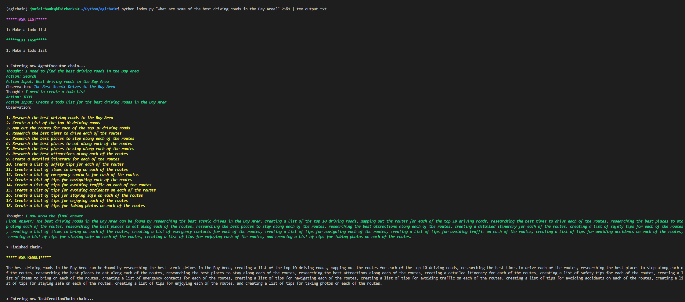

# agichain



BabyAGI + LangChain w/ Tools

### Prerequisites
- An [OpenAI](https://openai.com) API key
- A [SerpAPI](https://serpapi.com) API key

### Setup

Set API key values in .env

Install dependencies:
```
pipenv shell
pipenv install
```

### Usage

**Warning: Using this script can be very expensive!**
```
python index.py "What is the weather expected to be like this weekend in San Jose, CA?"
```

You can also save the output of your run to a text file.
```
python index.py "What is the weather expected to be like this weekend in San Jose, CA?" 2>&1 | tee output.txt
```